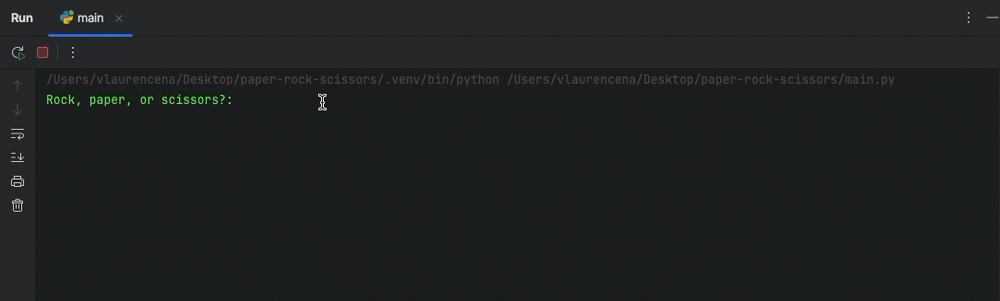

# Rock, Paper, Scissors Game

## Description
This is a simple Python implementation of the classic **Rock, Paper, Scissors** game. The player competes against the computer, which randomly selects its choice. The game continues in a loop until the player chooses to stop.

## Features
- Play an interactive game of Rock, Paper, Scissors in the terminal.
- The computer makes random choices to ensure fairness.
- Immediate feedback on each round (win, lose, or tie).

## How to Run

### Prerequisites
- Python 3.x installed on your system.

### Steps
1. Clone the repository or download the file `main.py`:
```bash
git clone https://github.com/vlaurencena/paper-rock-scissors.git
```
2. Navigate to the project directory:
```bash
cd paper-rock-scissors
```
3. Run the script:
```py
python3 main.py
```
